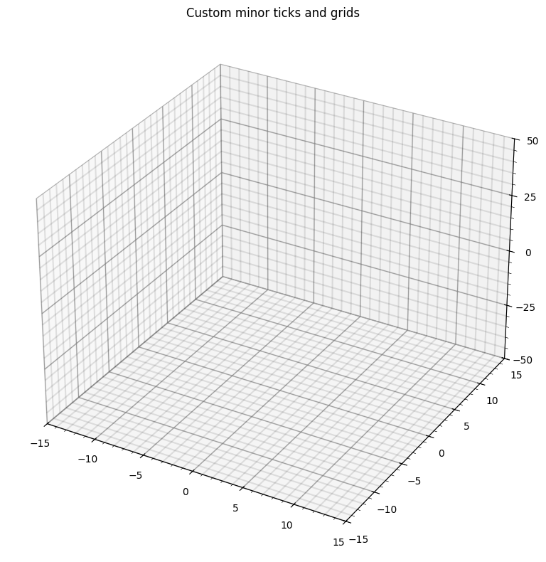

### **An example**

```.py
import matplotlib.pyplot as plt
import numpy as np
from matplotlib.ticker import MultipleLocator
from mpl_toolkits.mplot3d.art3d import Line3DCollection

# Create a figure and a 3D axes object
fig = plt.figure(figsize=(8, 8))
ax = fig.add_subplot(111, projection='3d')

x_min, x_max, x_minor, x_major = -15, 15, 1, 5
y_min, y_max, y_minor, y_major = -15, 15, 1, 5
z_min, z_max, z_minor, z_major = -50, 50, 5, 25

draw_custom_limits_ticks_grids(ax, x_min, x_max, y_min, y_max, z_min, z_max, 
                            x_minor, y_minor, z_minor, x_major, y_major, z_major)

ax.set_title('Custom minor ticks and grids')

plt.show()
```

